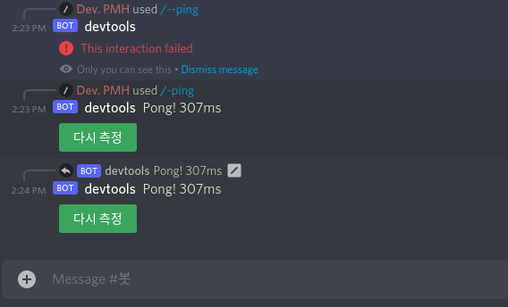

# discord.js 모던 베이스 템플릿
**discordjs-modern-base-ko**은 `discord.js` 버전 13을 통한 봇 개발을 편리하게 하기 위해 제작되었습니다.



해당 템플릿은 빗금 명령어 지원과 메시지 컴포넌트를 지원합니다.

상황에 따라 `개발 모드`와 `프로덕션 모드` 로 실행할 수 있습니다.

> :warning: **경고!**\
> 꼭, 본 `README.md` 파일을 끝까지 읽고 진행해 주세요.

<br />

## 사용법
### 1. 준비물 확인
해당 템플릿을 사용하기 위해서는 다음과 같은 준비물이 필요합니다:

* node.js (버전 16 혹은 그 이상)
* npm 혹은 yarn
* 빠른 인터넷 환경

### 2. 저장소 생성
[](https://github.com/pmh-only/discordjs-modern-base-ko/generate) 버튼을 눌러줍니다

`Repository name`에 원하는 봇 이름을 적고 `Create repository from template` 버튼을 눌러줍니다.

### 3. 저장소 클론
다음 명령어를 입력해 저장소를 클론합니다.

```
git clone https://github.com/유저명/봇이름
```

### 4. 환경 구성
템플릿에 미리 구성된 모듈들을 다운로드 받아줍니다.

`npm i` 혹은 `yarn`을 입력합니다.

`.env.example` 파일을 `.env` 파일로 복사하고

`.env` 파일에 적힌 `DISCORD_TOKEN`와 `ENVIROMENT_DEV_GUILD`를 설정합니다.

### 5. 실행
```
npm run dev:watch 혹은 yarn dev:watch
```
를 입력해 기본 템플릿을 실행합니다.

만약 자동 재시작이 불필요 한경우 `npm run dev, yarn dev` 만 입력하면 됩니다.

### 6. 수정
파일 구조는 다음과 같습니다:
```
src
  ㄴ commands
      ㄴ ping.ts
  ㄴ events
      ㄴ onReady.ts
      ㄴ onInteractionCreate.ts
```

`src/commands` 폴더 안에 파일을 수정하고 추가하여 명령어를 수정하고 추가할 수 있습니다.

`src/events/onInteractionCreate.ts`에서 이미 `inteaction.reply()`를 사용하였기 때문에 `src/commands` 폴더 안에서는 `interaction.editReply()`를 사용하세요. 

자세한 내용은 `src/commands/ping.ts`에 적힌 명령어 예시를 참고하세요.

<br />

## 프로덕션 모드 사용법
개발이 완료된 경우 `프로덕션 모드`를 통해 사용자에게 서브할 수 있습니다.

### 1. 모드 전환
`.env` 파일에서 `ENVIROMENT_DEV_GUILD` 값의 줄을 주석처리 하거나 삭제해 `프로덕션` 모드로 전환 시킬 수 있습니다.

### 2. 명령어 등록
`개발 모드`와 달리 `프로덕션 모드`에서는 명령어를 따로 등록해주어야 합니다.

> :warning: **경고!**\
> 일일 등록 제한 수가 있으며 적용까지 매우 긴 시간이 걸릴 수 있습니다.

다음 명령어를 입력해 등록을 진행합니다:
```
npm run regist 혹은 yarn regist
```

### 3. 빌드
다음 명령어를 통해 빌드를 진행합니다:
```
npm run build 혹은 yarn build
```

### 4. 실행
다음 명령어를 통해 봇을 실행합니다:
```
npm start 혹은 yarn start
```
